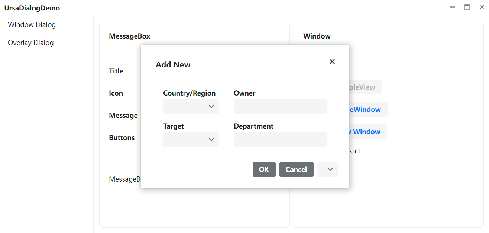
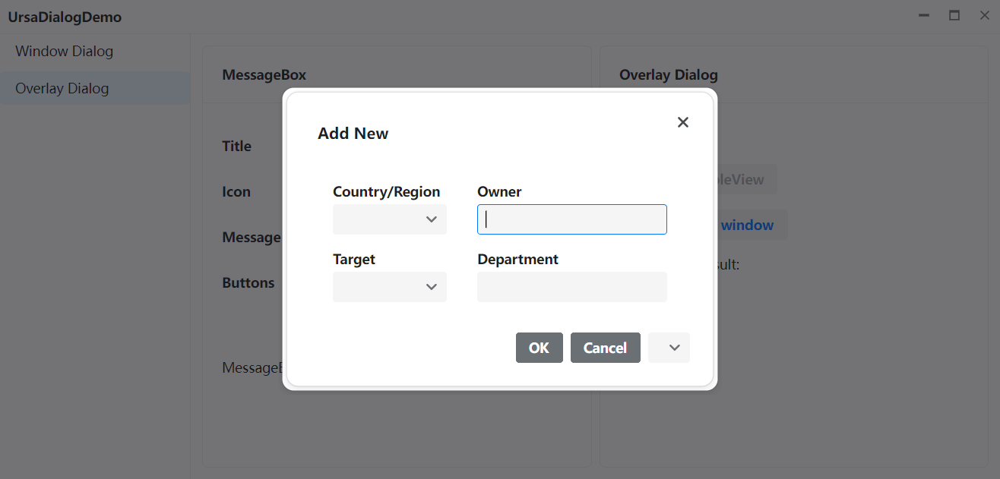

# MvvmDialogs.Avalonia.Ursa

An implementation of [HanumanInstitute.MvvmDialogs](https://github.com/mysteryx93/HanumanInstitute.MvvmDialogs) using [Ursa.Avalonia](https://github.com/irihitech/Ursa.Avalonia) as UI.

## Usage

Use `UrsaWindowDialogService` if you want to show dialog as a Window, and `UrsaOverlayDialogService` as an Overlay Dialog.

# Screenshots

Window dialog


Overlay dialog


## DialogContext

A problem of using MVVM Dialog is how to identify the owner Window, especially when your APP has multiple windows.

`DialogContext` can be used to find owner Window. Implement `IDialogContextOwner` interface in your ViewModel class, set `DialogContext.ToplevelHashCode` as the HashCode of the window you want to show dialog in, and set `this` as owner ViewModel when show dialog. The manager would automatically find the right window.

`DialogContext.HostId` is used to find `OverlayDialogHost` when using `UrsaOverlayDialogService`. This is required only when you are using a `OverlayDialogHost` in you control; if you use `UrsaWindow` or `UrsaView`, just set the ToplevelHashCode as the owner window's hashcode, Ursa can find the right window and OverlayDialogHost to show dialog in.

### Best Practices

When you are using IoC container, the best way to use `DialogContext` is implementing a DialogContextProvider:

```csharp
public class DialogContextProvider
{
    public DialogContext DialogContext { get; set; } = new DialogContext(0, null);
}
```
Register the DialogContextProvider as scoped service. In ViewLocator, set the DialogContext when create a new window:
```csharp
public class ViewLocator : StrongViewLocator
{
    private readonly IDialogContextProvider _dialogContextProvider;
    public ViewLocator(IDialogContextProvider dialogContextProvider)
    {
        _dialogContextProvider = dialogContextProvider;
        
        RegisterViews();
    }

    public override object Create(object viewModel)
    {
        var control = base.Create(viewModel);
        if (control is Window window)
        {
            _dialogContextProvider.DialogContext = new DialogContext(window.GetHashCode(), null);
        }

        return control;
    }

    public void RegisterViews()
    {
        ....
    }
}
```

And create a new scope when you start a new window:
```csharp
serviceCollection.AddScoped<IDialogContextProvider, DialogContextProvider>();
....
public class YourViewModel : ViewModelBase, IDialogContextOwner
{
    private readonly IServiceProvider _serviceProvider;
    private readonly IDialogService _dialogService;
    private readonly IDialogContextProvider _dialogContextProvider;
    
    //Constructor is omited
    
    public DialogContext? DialogContext
    {
        get => _dialogContextProvider.DialogContext;
        set
        {
            if(value!=null)
                _dialogContextProvider.DialogContext = value;
        }
    }
    
    public async Task SomeCommand()
    {
        var scope = _serviceProvider.CreateScope();
        var vm = scope.ServiceProvider.GetRequiredService<YourDialogViewModel>();
        await _windowDialogService.ShowDialogAsync(this, vm);
    }
}
```
Both window and overlay dialog will be shown in the right window.

To find a full sample, see the `MvvmDialogs.Avalonia.Ursa.Demo` project.